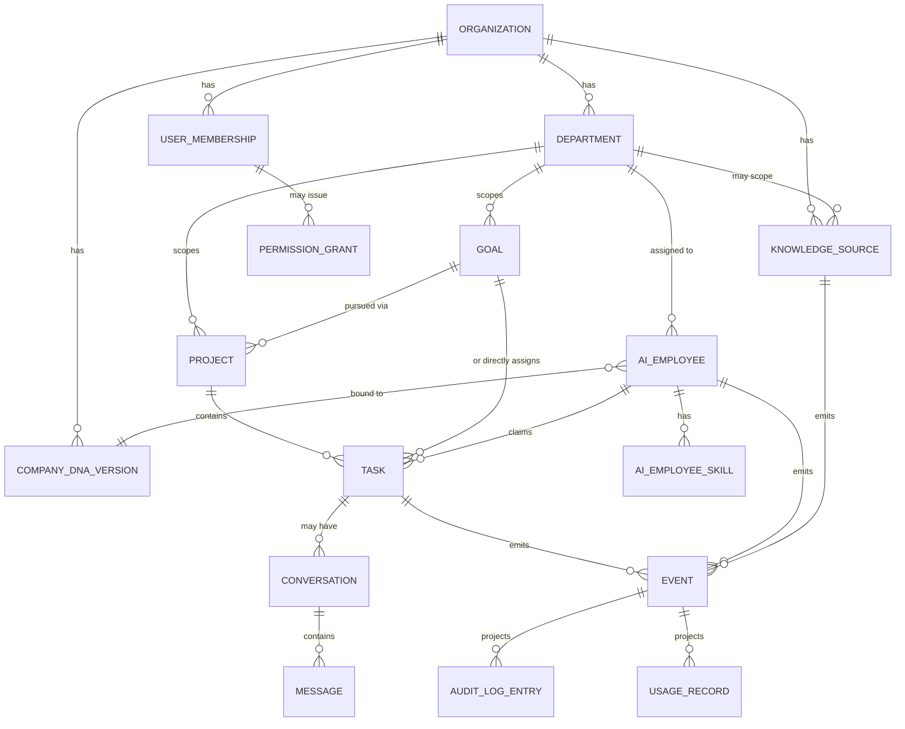

# Domain Model

**Status:** v1.0 — Foundational
**Owner:** Platform Engineering / Product Engineering
**Depends on:** [Database.md](./Database.md), [AIEmployees.md](./AIEmployees.md), [CompanyDNA.md](./CompanyDNA.md), [Memory.md](./Memory.md)
**Companion to:** [EventCatalog.md](./EventCatalog.md), [StateMachines.md](./StateMachines.md)

---

## 1. Purpose

This document is the conceptual map of Velora's domain — every object that exists in the system, what it means, and how it relates to everything else. `Database.md` describes the *physical* schema; this document describes the *domain* underneath it. They must stay in sync: any new entity introduced here is mirrored into `Database.md` in the same change, not deferred.

This document introduces four entities not previously modeled (**Project**, **Knowledge Source**, **Conversation/Message**, **Permission Grant**) and formalizes one that existed only implicitly (**Event**). All five are now reflected in [Database.md §3.7–3.11](./Database.md#37-knowledge).

## 2. Domain Objects

### 2.1 Organization

The tenancy root. Every other object in this document belongs, directly or transitively, to exactly one Organization. See [Database.md §3.1](./Database.md#31-identity--organization) and [Security.md §4](./Security.md#4-tenant-isolation).

### 2.2 Department

The unit of delegation within an Organization — mirrors how a real business assigns work (Sales, Support, Finance). Departments own budgets, scope Digital Employee permissions and memory namespaces by default, and are the primary parent for Goals, Projects, and Knowledge Sources. See [Database.md §3.2](./Database.md#32-departments).

### 2.3 User & Organization Membership

A human identity, which may belong to multiple Organizations via separate `organization_memberships` rows, each carrying its own RBAC role. See [Database.md §3.1](./Database.md#31-identity--organization) and [Security.md §3.2](./Security.md#32-multi-org-scoping).

### 2.4 Digital Employee

A persistent, named, addressable AI agent — identity, role/template, Department assignment, Company DNA binding, permission scope, memory namespace, performance record, autonomy configuration. Fully specified in [AIEmployees.md](./AIEmployees.md); schema in [Database.md §3.3](./Database.md#33-ai-workforce).

### 2.5 Skill

A concrete, executable capability a Digital Employee can be granted (`send_email`, `query_crm`, `generate_document`). Skills are catalog entries with a declared input schema and required permission scope, bound to specific Digital Employees via `ai_employee_skills`. See [Database.md §3.3](./Database.md#33-ai-workforce).

### 2.6 Company DNA (Version)

The versioned, org-authored "constitution" — identity, knowledge, behavioral, and process layers — that grounds every Digital Employee's reasoning. Deliberately separate from Memory (§2.11). Fully specified in [CompanyDNA.md](./CompanyDNA.md); schema in [Database.md §3.4](./Database.md#34-company-dna).

### 2.7 Knowledge Source

**New in this revision.** A Knowledge Source is the org-facing record of a single ingested body of knowledge — an uploaded document, a connected app (Google Drive, Notion, a website crawl), or a completed DNA questionnaire. It is distinct from Company DNA and from Memory:

- Company DNA's Knowledge Layer and an org's semantic Memory can both be *fed by* a Knowledge Source, but the Knowledge Source itself is the auditable, manageable unit ("here are the 40 documents this org has uploaded, and here's the status of each one").
- A Knowledge Source has a `destination` — it may feed Company DNA's knowledge layer, general org/department Memory, or both — decided at upload/connection time (or by department scoping: org-wide uploads default to DNA, department-scoped uploads default to that department's Memory namespace, both overridable).
- Its lifecycle (upload → processing → indexed) is detailed in [StateMachines.md §5](./StateMachines.md#5-knowledge-source-lifecycle) and its fine-grained processing pipeline in [StateMachines.md §6](./StateMachines.md#6-knowledge-processing-pipeline).

Schema: [Database.md §3.7](./Database.md#37-knowledge).

### 2.8 Goal

A business-level objective, org- or department-scoped, with a success metric and target (e.g., "reduce churn by 10% this quarter"). Goals are decomposed by the Goal Engine into Projects and/or Tasks. Schema: [Database.md §3.5](./Database.md#35-goals-projects--tasks).

### 2.9 Project

**New in this revision.** A Project is the concrete initiative undertaken to pursue a Goal — the layer between strategic intent and atomic execution. Where a Goal answers "what outcome do we want and how do we measure it," a Project answers "what body of work are we actually doing about it."

- A Project *may* roll up to a Goal (`goal_id`, nullable) — some Projects are ad hoc initiatives with no formal Goal tracking behind them, and that's fine; not every piece of work needs a measured objective.
- A Project belongs to exactly one Department and contains many Tasks.
- Projects have a simple lifecycle (`planned → active → completed | cancelled`) — deliberately simpler than Goals or Tasks, since a Project is a container, not itself an executable unit. See [Database.md §3.8](./Database.md#38-projects).

**Why this layer exists:** without it, Tasks attach directly to Goals, which conflates "the thing we're measuring" with "the thing we're doing," and makes it awkward to model work that spans multiple Goals or no Goal at all (e.g., a Digital Employee onboarding project that supports several churn/retention Goals simultaneously). Introducing Project as a distinct, optional layer keeps Goals purely about outcomes and measurement.

### 2.10 Task

The assignable, executable unit of work — claimed and worked by a Digital Employee or a human, tracked through a Kanban-like lifecycle (`pending → claimed → in_progress → blocked → done | failed`). A Task may belong to a Project (`project_id`, nullable) and/or directly to a Goal (`goal_id`, nullable) — both nullable because ad hoc tasks (not tied to any goal-tracking) are a normal occurrence. Full lifecycle: [StateMachines.md §3](./StateMachines.md#3-task-lifecycle). Schema: [Database.md §3.8](./Database.md#38-projects) (revised).

**Action** (a single skill invocation within a Task) is not modeled as its own top-level table — it is represented as a `skill.invoked`/`skill.succeeded`/`skill.failed` Event (§2.14) with a `task_id` reference. This avoids a redundant table whose entire purpose is already served by the event log.

### 2.11 Memory (Working / Episodic / Semantic / Procedural)

The dynamic, agent-generated substrate of what's been observed and learned. Fully specified in [Memory.md](./Memory.md). Not a domain object with its own top-level identity in the same sense as the others — it is a set of storage-backed views (Redis, Postgres rollups, Qdrant) derived from Events (§2.14), namespaced by Organization → Department → Digital Employee.

### 2.12 Conversation & Message

**New in this revision.** A Conversation is a thread of communication — between a human and a Digital Employee, between multiple Digital Employees collaborating on a shared Task, or a broadcast. A Message is a single entry in that thread.

- `Conversation.context_type` distinguishes `task_thread` (tied to a specific Task), `direct_chat` (human ↔ Digital Employee, no Task), and `broadcast` (fan-out, e.g. a "new customer" notification thread).
- Every Message has an attributable `sender_type`/`sender_id` — same attribution discipline as everything else in the platform (no anonymous or ambiguous "the system said" messages).
- Conversations are the concrete home for what the Agent Collaboration layer calls "shared context per task" — multiple Digital Employees contributing to one Task read and write the same Conversation rather than passing state through side channels.
- Messages are a write path into episodic Memory (a completed conversation gets summarized into the relevant Memory namespace) but are themselves stored relationally for exact ordering and replay — see [Database.md §3.9](./Database.md#39-collaboration-conversations--messages).

### 2.13 Permission Grant

**New in this revision.** Most authorization in Velora is *not* row data — it's RBAC roles (`organization_memberships.role`) and ABAC policy-as-code evaluated by the centralized Policy Engine ([Security.md §5](./Security.md#5-authorization-model)). Permission Grant models the **explicit, auditable exception** cases the rest of the system already assumes exist but didn't yet have a concrete home:

- Cross-department Memory access ([Memory.md §3](./Memory.md#3-sharing-model): "requires an explicit policy grant").
- Temporarily expanded Digital Employee skill scope beyond its template default.
- Any grant a human explicitly issues that isn't derivable from role or standing policy.

A Permission Grant has a `grantee` (Digital Employee, User, or Department), a `resource_scope` (what it grants access to), a granting User (accountability), and an optional expiry (`expires_at`) — grants are not assumed permanent by default. Schema: [Database.md §3.10](./Database.md#310-permission-grants).

**Boundary to keep clear:** if you're tempted to model something as a Permission Grant that's actually a standing rule applying to every Digital Employee of a given role or department, it belongs in the Policy Engine's policy-as-code, not as a row here. Permission Grant is for exceptions, not for the default rule set.

### 2.14 Event

**New in this revision (formalized).** An Event is the immutable record of something that happened — the platform-wide source of truth from which all other state is derived (episodic Memory, the Audit Log, Analytics, Billing/Metering all read from the same stream rather than each other). Every meaningful state change in every domain object above is represented as an Event.

For v1 (modular monolith, no message broker in the stack — see the architectural note below), Events are rows in a Postgres `events` table, written transactionally alongside the state change that produced them (the outbox pattern), then relayed asynchronously to Redis Streams for in-process and background-worker consumption. Full catalog: [EventCatalog.md](./EventCatalog.md). Schema: [Database.md §3.11](./Database.md#311-event-store).

> **Architectural note:** the original conceptual draft assumed a Kafka/Pulsar-class broker as "the nervous system connecting all of the above." The concrete v1 stack (FastAPI/Postgres/Redis/Qdrant) has no broker. Rather than introduce one prematurely for a system that is currently one deployable unit, v1 implements the same *contract* (durable, ordered-per-tenant, replayable events) on Postgres + Redis Streams, and defers adopting a real broker to the point where module extraction ([Deployment.md §8](./Deployment.md#8-scaling-path-deployment-dimension)) actually requires decoupling independent deployables. See [ADR 0001](./decisions/0001-event-store-implementation.md) for the full reasoning.

### 2.15 Audit Log Entry & Usage Record

Both are queryable Postgres **projections** of the Event stream, not independently written — see [Database.md §3.6](./Database.md#36-audit--metering-relational-projections). Not modeled as separate domain concepts here beyond that: they are views onto Events, kept for query performance (exact-match audit queries, billing aggregation) that would be awkward to run against the raw event log directly.

## 3. Relationship Overview

## 4. Cross-Reference: Domain Object → Owning Documents

| Domain Object | Schema | Behavior / Lifecycle | Events |
|---|---|---|---|
| Organization | Database.md §3.1 | Security.md §4 | EventCatalog.md §Identity |
| Department | Database.md §3.2 | — | EventCatalog.md §Identity |
| Digital Employee | Database.md §3.3 | AIEmployees.md, StateMachines.md §2 | EventCatalog.md §AI Workforce |
| Skill | Database.md §3.3 | AIEmployees.md §7 | EventCatalog.md §Skill Execution |
| Company DNA Version | Database.md §3.4 | CompanyDNA.md, StateMachines.md (DNA follows the same publish/version pattern as §6) | EventCatalog.md §Company DNA |
| Knowledge Source | Database.md §3.7 | StateMachines.md §5–6 | EventCatalog.md §Knowledge |
| Goal | Database.md §3.5 | StateMachines.md §4 | EventCatalog.md §Goals/Projects/Tasks |
| Project | Database.md §3.8 | §2.9 above | EventCatalog.md §Goals/Projects/Tasks |
| Task | Database.md §3.8 | StateMachines.md §3 | EventCatalog.md §Goals/Projects/Tasks |
| Memory | Memory.md | Memory.md §4–6 | EventCatalog.md §Memory |
| Conversation / Message | Database.md §3.9 | §2.12 above | EventCatalog.md §Collaboration |
| Permission Grant | Database.md §3.10 | Security.md §5 | EventCatalog.md §Security |
| Event | Database.md §3.11 | ADR 0001 | EventCatalog.md (all) |
| Audit Log Entry / Usage Record | Database.md §3.6 | Security.md §7 | derived, not producing |

## 5. Non-Goals (v1)

- No generic "custom object" framework — the domain objects above are fixed, first-class concepts. Org-specific customization happens through Company DNA, department structure, and Skill configuration, not through a schema-less custom-fields system.
- No formal sub-typing of Task by department/function at the schema level (a "SalesTask" vs. "SupportTask") — differentiation happens through the assigned Digital Employee's Skill and DNA context, not through the Task schema itself.
- Project does not yet have its own state machine document — its lifecycle (§2.9) is intentionally simple enough not to warrant one at v1; revisit if Project behavior grows more complex than a four-state container.
