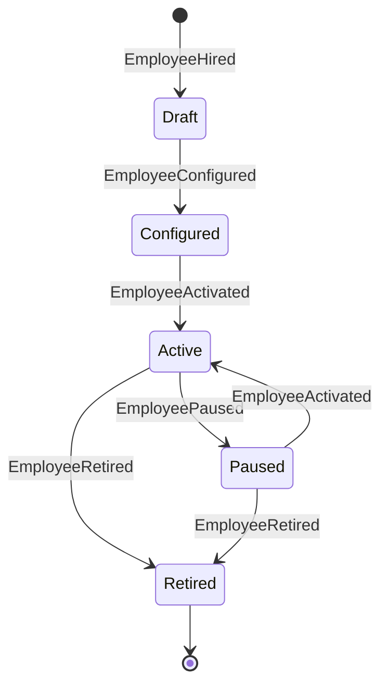
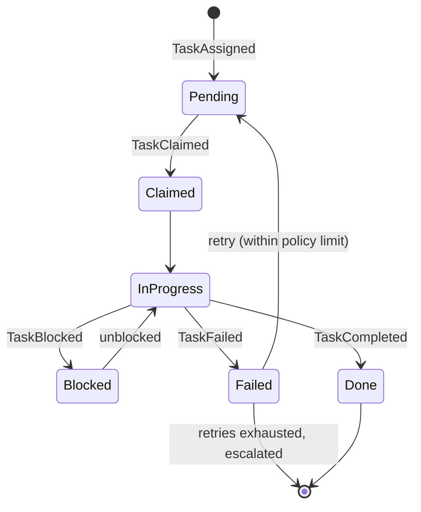
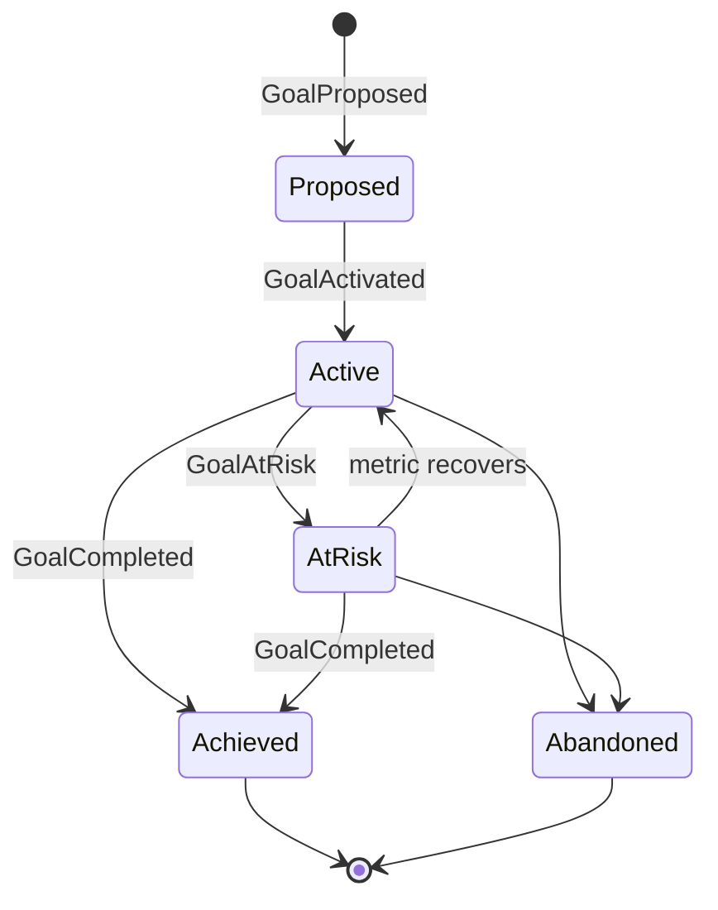
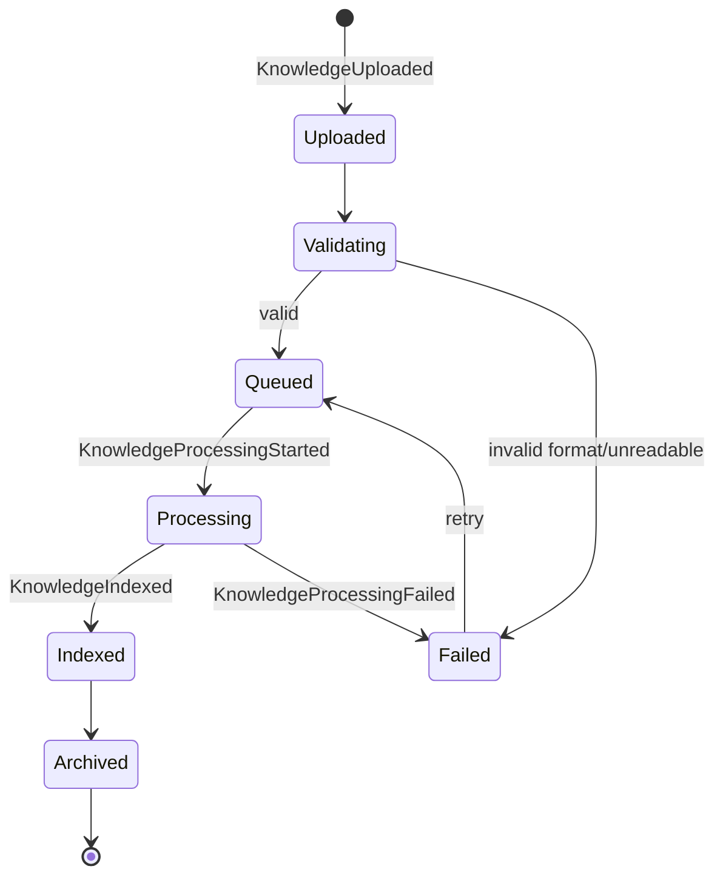
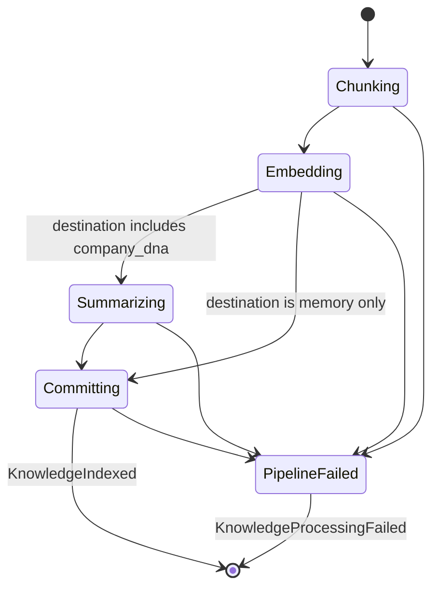

# State Machines

**Status:** v1.0 — Foundational
**Owner:** Platform Engineering
**Depends on:** [DomainModel.md](./DomainModel.md), [EventCatalog.md](./EventCatalog.md)

---

## 1. Purpose

This document defines the lifecycle state machine for every domain object whose behavior is meaningfully stateful: Digital Employees, Goals, Tasks, Knowledge Sources (Documents), and the Knowledge Processing pipeline. For each: the states, the valid transitions, what triggers each transition, who/what is allowed to trigger it, and which event fires as a result.

**Cross-cutting rule:** every state transition emits exactly one event ([EventCatalog.md](./EventCatalog.md)), and every transition handler is idempotent (safe to receive the same trigger twice — e.g., a retried request should not double-transition a Task). No domain object in this document has a state transition that happens silently, without a corresponding event.

## 2. Digital Employee Lifecycle

| Transition | Trigger | Who/what may trigger | Guard |
|---|---|---|---|
| `[*] → Draft` | Provisioning initiated | Human (org_admin or department_manager) | Template + department selected |
| `Draft → Configured` | DNA + permission scope bound | Human | Both DNA version and permission scope must be explicitly set — see [AIEmployees.md §3](./AIEmployees.md#3-lifecycle) |
| `Configured → Active` | Explicit activation | Human | Cannot be skipped from `Draft` |
| `Active → Paused` | Manual pause, or automatic | Human, **or** Policy Engine (policy violation / `BudgetExceeded`) | — |
| `Paused → Active` | Manual resume | Human only — automatic pauses never auto-resume | Underlying cause must be addressed (e.g., budget cap raised) |
| `Active/Paused → Retired` | Explicit retirement | Human | In-flight `claimed`/`in_progress` Tasks are reassigned as a side effect, not a precondition |

Full behavioral detail: [AIEmployees.md §3](./AIEmployees.md#3-lifecycle).

## 3. Task Lifecycle

| Transition | Trigger | Who/what may trigger | Guard |
|---|---|---|---|
| `[*] → Pending` | Goal Engine decomposition or direct creation | Goal Engine, human | Must reference a valid Department |
| `Pending → Claimed` | A Digital Employee claims it | Agent Collaboration Layer, on behalf of a Digital Employee whose skill profile matches | **Optimistic-lock claim** — first successful claim wins; a losing concurrent claim attempt fails cleanly, does not error the Task |
| `Claimed → InProgress` | Execution begins | System (immediate, same invocation) | — |
| `InProgress → Blocked` | Missing dependency or awaiting human input (`approve` autonomy gate) | Agent Collaboration Layer | — |
| `Blocked → InProgress` | Dependency resolved / human approval received | System, human | — |
| `InProgress → Done` | Skill execution(s) succeeded, success criteria met | System | Idempotency key on the underlying `SkillInvoked` prevents double-execution on retry — [API.md §5](./API.md#5-the-async-task-pattern) |
| `InProgress → Failed` | Skill execution failed or errored | System | — |
| `Failed → Pending` | Automatic retry with backoff | System | Only while `retry_count` is under the policy-defined limit — [Agent Collaboration failure handling] |
| `Failed → [*]` (terminal) | Retries exhausted | System | Escalates to a human via Notification Service rather than silently dying |

A **claim** is the mechanism preventing duplicate work: multiple Digital Employees may be eligible for the same Task, but the claim is a single atomic DB operation (`UPDATE ... WHERE status = 'pending'` with the row lock implicit in the `WHERE`), so exactly one claim succeeds regardless of how many Digital Employees attempt it concurrently.

## 4. Goal Lifecycle

| Transition | Trigger | Who/what may trigger | Guard |
|---|---|---|---|
| `[*] → Proposed` | Human states a high-level objective | Human (department_manager or org_admin) | Goal Engine has produced a decomposition plan |
| `Proposed → Active` | Approval | Human, **or** automatic if the department's policy allows auto-approval for low-risk/high-autonomy contexts — [original Goal Engine design, §11.3] | — |
| `Active ⇄ AtRisk` | Continuous Evaluation Loop re-measures the success metric | System (scheduled + event-triggered) | Threshold defined per goal's `success_metric` config |
| `Active/AtRisk → Achieved` | Success metric target reached | System (Evaluation Loop) | — |
| `Active/AtRisk → Abandoned` | Explicit human decision | Human | Not automatic — abandoning a goal is always a deliberate call, never inferred |

The Evaluation Loop may also, on detecting `AtRisk`, autonomously spawn new Tasks/Projects (re-planning) rather than only escalating — that re-planning behavior produces ordinary `TaskAssigned`/`ProjectCreated` events, not a distinct Goal state.

## 5. Knowledge Source Lifecycle

| State | Meaning |
|---|---|
| `uploaded` | Raw source registered (file received, connector linked, questionnaire submitted) |
| `validating` | Format/size/access checks | 
| `queued` | Passed validation, waiting for a processing pipeline slot |
| `processing` | The Knowledge Processing pipeline (§6) is actively running |
| `indexed` | Available for retrieval via its `destination` (Company DNA and/or Memory) |
| `failed` | Terminal for this attempt — retryable up to a policy limit, then requires human intervention |
| `archived` | No longer actively retrieved, but retained for audit — reached via explicit archival or redaction ([Memory.md §6.2](./Memory.md#62-right-to-forget)) |

A Knowledge Source's coarse status here is a **derived summary** of its finer-grained position within the Knowledge Processing pipeline (§6) — `processing` covers several internal sub-stages that Knowledge Sources themselves don't need to expose.

## 6. Knowledge Processing Pipeline

The internal pipeline a Knowledge Source moves through while in the `processing` state — the same shape as the Company DNA Compiler pipeline ([CompanyDNA.md §4.2](./CompanyDNA.md#42-compilation)), since DNA ingestion is one of the two possible destinations for a Knowledge Source.

| Stage | Description |
|---|---|
| `Chunking` | Source content split into retrieval-sized segments |
| `Embedding` | Each chunk embedded into a vector, written to the appropriate Qdrant collection (`dna_knowledge_{organization_id}` and/or `memory_{organization_id}`, per `destination`) |
| `Summarizing` | Only when `destination` includes `company_dna` — candidate additions to the compiled always-in-context summary are drafted (still requires human publish per [CompanyDNA.md §4.3](./CompanyDNA.md#43-versioning); this stage produces a draft, not a live change) |
| `Committing` | Final write of provenance metadata, chunk counts, and status; emits `KnowledgeIndexed` |
| `PipelineFailed` | Any stage may fail (malformed content, embedding provider error, timeout) — retried up to a policy limit before the Knowledge Source itself moves to `failed` |

Each stage transition is itself an internal event for observability/debugging purposes but is not part of the public Event Catalog (§5) unless it crosses a domain boundary — only `KnowledgeProcessingStarted`, `KnowledgeIndexed`, and `KnowledgeProcessingFailed` are catalog events; intra-pipeline stage transitions are logged/traced (see [Observability.md](./Observability.md)) but not separately cataloged, to avoid event-catalog noise for what is really one pipeline's internal detail.

## 7. Non-Goals (v1)

- No state machine for Project — its lifecycle is a simple four-state container (`planned → active → completed | cancelled`) that doesn't yet warrant a dedicated diagram; see [DomainModel.md §2.9](./DomainModel.md#29-project).
- No generic/reusable state-machine engine or DSL — each lifecycle above is implemented directly in its owning module's application layer. A shared state-machine framework is worth considering only if a sixth or seventh lifecycle starts duplicating real logic, not preemptively.
- No cross-object state coupling beyond what's stated above (e.g., Task failure escalation, Employee pause reassigning Tasks) — any other apparent coupling should be treated as a bug in this document, not an implicit rule, and reported for correction.
