# M4 — Organization Experience (Demo Notes)

**Status:** Completed and reviewed.
**Branch:** `feature/m4-organization-experience`
**Assets:** [screenshots](../screenshots/) (prefix `M4-`), [GIFs](../gifs/) (prefix `M4-`), [video](../videos/M4-walkthrough.mp4), [presenter script](../scripts/M4-demo-script.md)

---

## Project state

M4 is the milestone where Velora became something a person outside the engineering team can actually open in a browser and use. M1–M3 built the platform foundation, the multi-tenant data layer, and authentication — all real, all tested, but entirely behind an API with no interface. M4 is the first milestone with a real, working, end-to-end product surface: a person can create an account, log in, create their organization, and land on a real (if intentionally minimal) dashboard — and that session survives a page reload, which is a genuinely non-trivial thing to get right (see Security improvements, below).

## Features completed

- **Registration and login** — email/password, with inline validation errors matching what the backend actually returns (never a generic "something went wrong" when the backend gave a specific reason).
- **Organization onboarding** — a new user with no organization is routed to a create-organization screen; submitting a name is the entire form (no invented fields like industry or team size that nothing downstream uses yet).
- **Session-aware routing** — the app root (`/`) resolves, on every load: no organization → onboarding; exactly one organization → straight to the dashboard, with no extra click; more than one → a simple choice screen. This exact rule was specified in the product's own wireframe spec before this milestone existed, and this milestone is what actually implements it.
- **A real, minimal dashboard** — organization name, plan, status, the signed-in user, their role, and a working sign-out. Deliberately not a mockup of a future dashboard with fake "0 tasks" widgets — see Known limitations.
- **A session that survives a reload** — closing and reopening the tab, or hitting refresh, keeps you logged in without re-entering credentials, via a secure background refresh (see below).

## Architecture highlights

- **Modular monolith, unchanged shape:** the new `organizations` API layer plugs into the same FastAPI app, same Clean Architecture layering (`domain` → `infrastructure` → `application` → `api`) as every prior milestone. No new services, no new deployable units.
- **A new, real backend capability, not just a UI:** discovering "which organization(s) does this user belong to" required extending the database's Row-Level Security model itself — a second, narrowly-scoped security policy was added (and independently reviewed) specifically so that query is answerable at all, safely. This is documented as a formal Architecture Decision Record (`docs/architecture/decisions/0002-*.md`) precisely because it's the kind of decision a future engineer should be able to find the reasoning for, not just the result.
- **Sessions that don't quietly lose their organization context:** rotating a session's token (which happens automatically, every ~15 minutes, for as long as someone is using the app) now correctly preserves which organization that session belongs to. This sounds like a small detail; it's the kind of bug that would otherwise show up as "I keep getting logged out of my organization for no reason" a few minutes into a real demo.

## Security improvements

- **The refresh token — the credential that keeps someone logged in for weeks — never touches the browser's JavaScript-readable storage at all.** It lives only in an `httpOnly` cookie, meaning even a malicious script injected into the page cannot read or steal it. The short-lived access token (valid ~15 minutes) is the only thing held in memory client-side, and it's never written to disk.
- **A dedicated regression test proves the new database security policy can't be misused for writes**, not just reads — the specific failure mode a future code change could otherwise silently reintroduce.
- **The organization-creation and organization-selection actions are implemented as session rotations**, not a second parallel login — there is exactly one refresh-token lineage per real session, not an orphaned, forgotten one left behind every time someone creates or switches an organization.

## UI implemented

| Screen | Route | Status |
|---|---|---|
| Register | `/register` | ✅ Implemented |
| Login | `/login` | ✅ Implemented |
| Create Organization (onboarding) | `/onboarding` | ✅ Implemented |
| Dashboard | `/dashboard` | ✅ Implemented (minimal — see Known limitations) |
| Landing / marketing page | `/` | ❌ Not implemented — `/` is currently the session-resolution entry point (redirects to login or the right authenticated screen), not a marketing page. No screenshot exists for this because there is nothing to screenshot; see the product wireframe spec for what this screen is planned to eventually contain. |
| Organization switcher (2+ orgs) | — | ⚠️ Minimal-only — a plain list to pick from exists in code, but it is not reachable through any real flow yet (no invite feature exists, so no user can actually end up in more than one organization today). |

## User flow

```
Visit the app
      │
      ▼
Have an account? ──No──▶ Register ──▶ (auto) Log in
      │Yes                                  │
      ▼                                      │
   Log in ◀─────────────────────────────────┘
      │
      ▼
Belong to an organization already?
      │
   ┌──No──────────────┐         ┌──Yes, exactly one──────┐        ┌──Yes, more than one──┐
   ▼                   │         ▼                        │        ▼                       │
Create Organization ───┘   Dashboard (auto-entered) ───────┘   Choose an organization ───────┘
   │                                                                    │
   └────────────────────────────▶ Dashboard ◀──────────────────────────┘
                                        │
                                        ▼
                                   Sign out ──▶ back to Log in
```

## Known limitations

Stated plainly, not hidden: this is an intentionally small, honest slice of the eventual product, not a preview of features that don't exist yet.

- The dashboard shows organization identity and the signed-in user only — no Digital Employees, no Goals, no activity feed. There is nothing fake standing in for them (no "0 tasks completed" placeholder, no greyed-out "coming soon" widgets) — those features don't exist yet, so the dashboard doesn't pretend they do.
- Organization creation collects a name only — no industry, team size, or region selection, since nothing downstream (Company DNA suggestions, department templates) exists yet to use that information.
- No password reset, no email verification, no MFA, no SSO/OAuth — all explicitly out of scope for this milestone, per the backend authentication milestone (M3) that this UI sits on top of.
- The "choose an organization" screen exists in code but has no real path to reach it yet (see UI table above).

## What's next

The natural next slice is an invite flow (letting an `org_admin` add teammates to an existing organization) — it's the one thing that would make the multi-organization path in this milestone's own code actually reachable by a real user, and it's a logical, self-contained next milestone. That's a recommendation, not a commitment — see the M4 engineering completion report for the full risk/technical-debt list this decision should be weighed against.

---

## Gallery

### Screenshots

| | | |
|---|---|---|
| 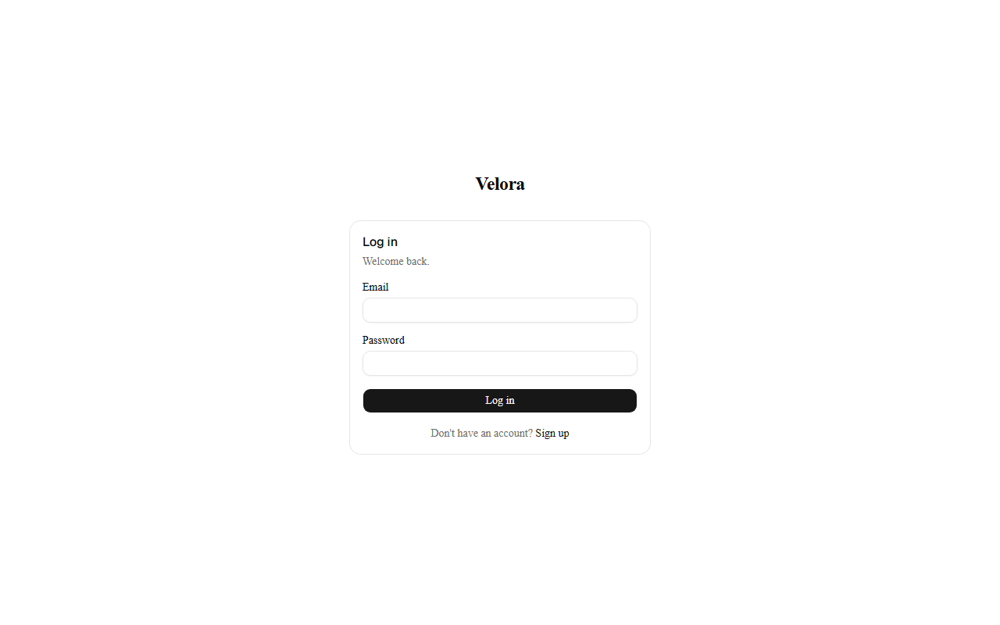 `01` Login | 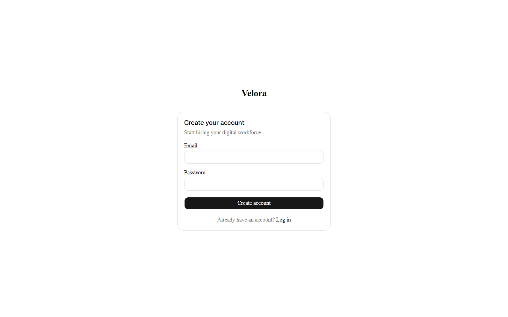 `02` Register | 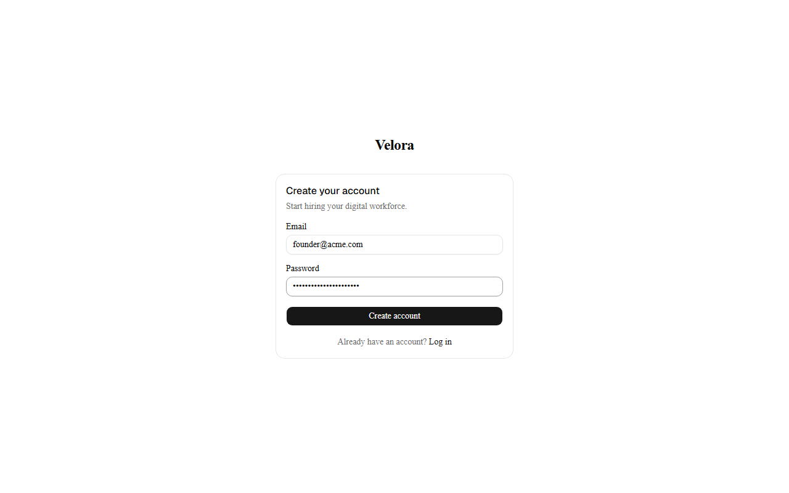 `03` Register (filled) |
| 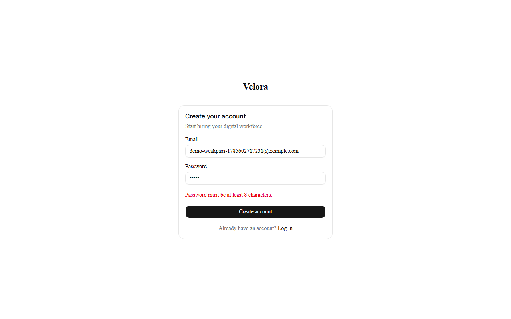 `04` Validation error | 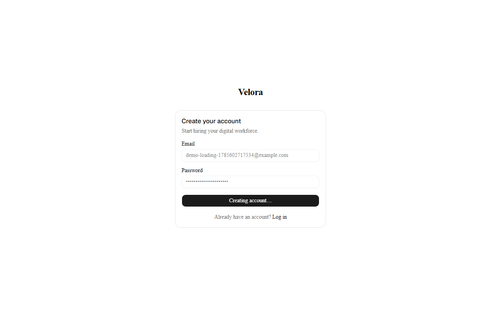 `05` Loading state | 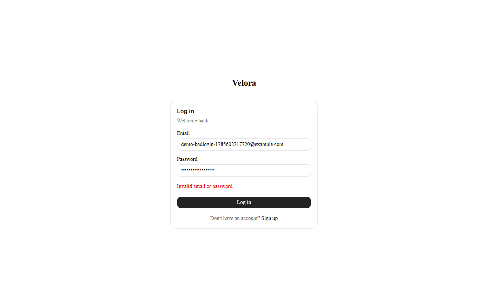 `06` Invalid credentials |
|  `07` Create organization | 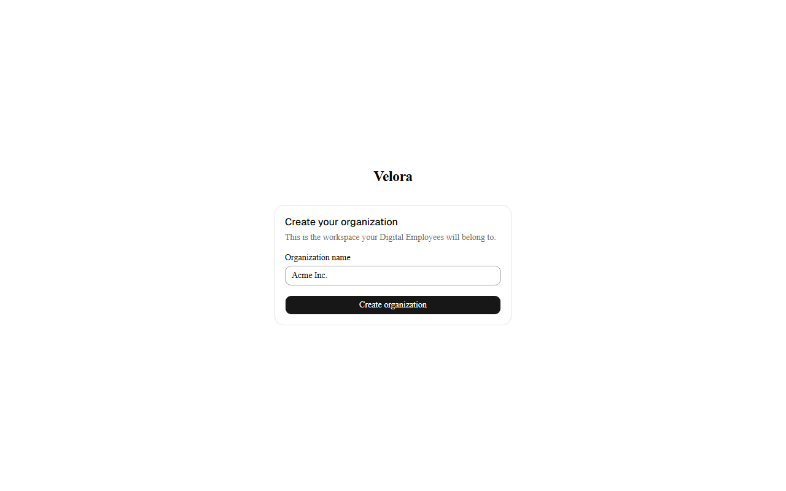 `08` Create organization (filled) |  `09` Loading state |
| 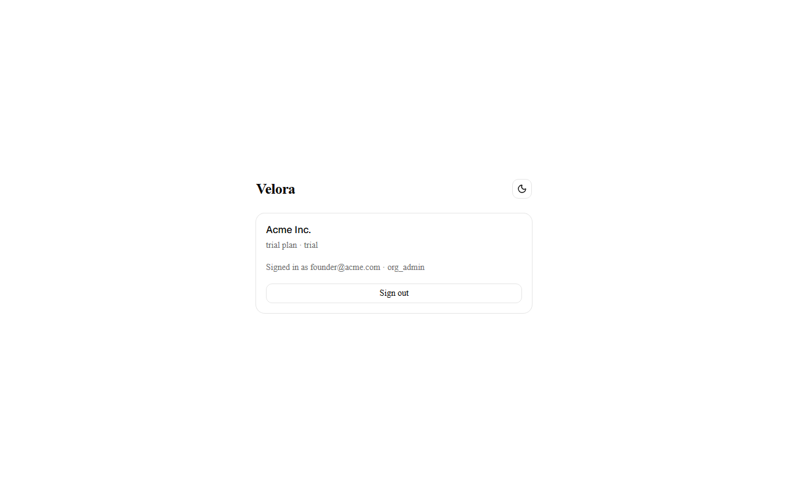 `10` Dashboard |  `11` Session-resolving transition | |

Landing page: **not implemented** — no screenshot exists; see the UI table above for why.

### GIFs

| Flow | |
|---|---|
| Register |  |
| Create organization | 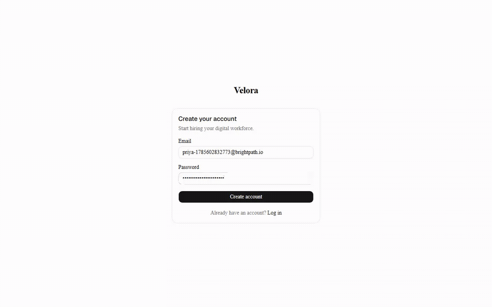 |
| Login | 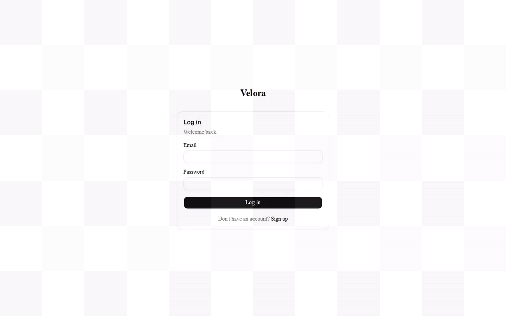 |
| Dashboard (incl. theme toggle) | 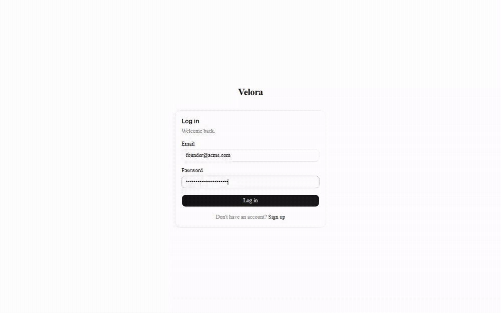 |
| Logout |  |

### Video

[`M4-walkthrough.mp4`](../videos/M4-walkthrough.mp4) — ~2:11, 1920×1080. Narration script: [`M4-demo-script.md`](../scripts/M4-demo-script.md).
