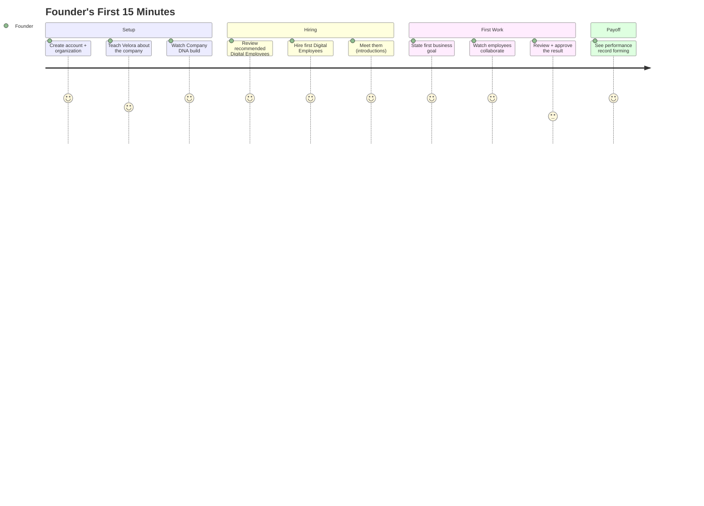
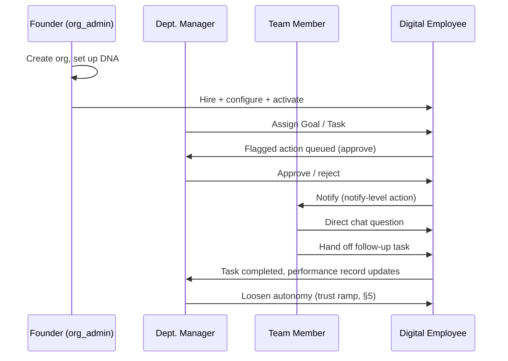

# Velora — User Journeys (MVP)

**Status:** Draft v1.0 — narrative companion to [PRD.md](./PRD.md); UX flow details here are proposals for Design to validate, not settled screens.
**Owner:** Product, drafted in collaboration with Engineering and Design
**Depends on:** [PRD.md](./PRD.md), [architecture/AIEmployees.md](../architecture/AIEmployees.md), [architecture/StateMachines.md](../architecture/StateMachines.md)

---

## 1. Purpose

[PRD.md §4](./PRD.md#4-core-product-loop) states the core product loop as a single line: create org → set up DNA → hire → configure → activate → assign → work happens → review → performance accumulates. This document walks through that loop as something a specific human actually experiences, stage by stage, across the personas defined in [PRD.md §3](./PRD.md#3-target-users--personas) — where they hesitate, what they need to see to trust the next step, and what it feels like when something goes wrong. Every stage links back to the PRD requirement ID that governs its behavior; this document does not restate acceptance criteria, it narrates the experience around them.

**Why this needs its own document, not just a section of the PRD:** the PRD answers "what must the system do." This answers "what does it feel like to use it" — and for Velora specifically, that experience has a dimension most SaaS products don't: a human is being asked to extend *trust* to an autonomous system incrementally, and the product's entire premise ("humans remain in control, AI executes work") lives or dies on whether that trust-building experience actually feels safe rather than either reckless or so cautious it defeats the point of hiring a Digital Employee at all. §5 is dedicated to that arc specifically.

## 2. Journey Map Convention

Each journey below is a table of stages. For each stage:

- **User goal** — what the human is trying to accomplish at that moment.
- **System response** — what Velora shows or does.
- **Moment that matters** — flagged (⚑) where trust, confusion, or delight is disproportionately concentrated — these are the points Design should prototype and test first, and Engineering should instrument most closely ([Observability.md §5](../architecture/Observability.md#5-decision-traces), Decision Traces exist largely to make these moments answerable).
- **Ref** — the PRD requirement ID(s) this stage depends on.

## 3. Primary Journey: Founder / Org Admin — The First 15 Minutes

This is the journey that determines whether Velora's core premise lands or doesn't. Everything else in the product is downstream of whether this first session ends with the founder believing "this actually did something for my business," not "this is an elaborate form." The experience should feel effortless, intelligent, and trustworthy — and it must do so **without** ever letting a Digital Employee take a real-world action the founder hasn't, in some visible way, signed off on. Those two goals are not in tension if the review moment is designed to feel like part of the magic rather than a interruption of it — see the callout after the table.



*(Scores are relative anticipated sentiment 1–5, not a measured metric — a design/prioritization aid, not data.)*

| Stage | User goal | System response | Moment that matters | Ref |
|---|---|---|---|---|
| Create account + organization | "Get in the door fast" | Org created, founder is `org_admin` immediately, no waiting on approval | — | ORG-1 |
| Teach Velora about the company | Skip typing what's already written down somewhere | Upload a website URL, PDFs, policies, brand guidelines — instead of (or alongside) the structured questionnaire | ⚑ If the only path is a blank-form questionnaire, the founder mentally files Velora as "another form to fill out" before ever meeting a Digital Employee. Letting them hand over what already exists is what makes step 1 feel effortless rather than like onboarding homework. | DNA-1, DNA-2, **DNA-4 (new, see note below)** |
| Watch Company DNA build | See evidence this was worth doing | Visible progress with concrete, specific checkpoints as they complete — e.g. *products/services detected, brand voice identified, policies extracted, departments suggested* — not a generic progress bar | ⚑ This is the first "it understood my business" moment — the single highest-leverage beat for making Velora feel intelligent rather than generic. Needs to feel like it's actually reading the material, not decorating a spinner. | DNA-1, **DNA-4 (new)** |
| Review recommended Digital Employees | Get a relevant starting point without having to know what to ask for | Velora proposes a short list of roles inferred from the detected departments/business type (e.g. Marketing Lead, Finance Analyst, Customer Success Lead, Operations Coordinator) rather than a full undifferentiated template catalog — founder can accept, swap, or browse the full catalog instead | ⚑ This is the first moment "Digital Employee" either reads as a real worker who already gets the business, or a feature list to shop. Recommendation quality matters more than catalog breadth here. | EMP-1, **EMP-5 (new, see note below)** |
| Hire | Commit to trying it | Immediate, low-ceremony — hiring is `draft`, reversible, not a scary irreversible action | — | EMP-1 |
| Meet them | Feel like a hire happened, not a config object was created | Each newly hired Digital Employee introduces itself in its own voice (grounded in the DNA just built) — name, role, what it's here to do | — | EMP-1, CompanyDNA.md §6 |
| State first business goal | Try it on something that actually matters to them | Plain language input, e.g. *"Increase qualified leads by 20%"* → system proposes a decomposition for review | GOAL-1, GOAL-2 |
| Watch employees collaborate | See this is a workforce, not one bot | Visible activity as multiple Digital Employees pick up related tasks together — the Task Board or an activity feed, not a black box | ⚑ This is what separates "workforce" from "chatbot" in the founder's mind. If only one employee visibly does anything, the collaboration story hasn't landed. | TASK-1, TASK-2, COLLAB-2 |
| Review + approve the result | Feel in control, not burdened | The first goal's output defaults to review-first — see the callout below — presented as *"here's what we're ready to do, take a look"* rather than a raw approval queue | ⚑ **This replaces a separate, scarier "configure permissions and autonomy" screen.** Handled well, this is where "humans remain in control" is *felt*, not just stated — see callout below. Handled poorly (buried settings, or skipped and executed live), it either kills the wow or breaks the platform's core promise. | EMP-2, OVR-1 |
| See performance record forming | Feel like they hired someone, not configured a tool | Framed as a review, not a metrics dashboard — "Riley completed 3 tasks today, 1 needs your review" | — | EMP-4 |

> **Why the permissions/autonomy step disappears from this table, and where it actually went:** it doesn't go away — [AIEmployees.md §3](../architecture/AIEmployees.md#3-lifecycle) still requires a bound permission scope and explicit autonomy before a Digital Employee reaches `active`, and that's not negotiable. What changes is *when the founder notices it*. Every newly hired Digital Employee's autonomy defaults to `approve` on anything external or financial ([AIEmployees.md §6](../architecture/AIEmployees.md#6-human-oversight-model-autonomy-levels)) — sensible minimums are applied silently at hire time, not asked about up front. The founder's first encounter with autonomy is therefore the *review-and-approve* moment on real output they already care about, which is a more meaningful and less abstract place to first exercise that control than a settings screen they haven't earned context for yet. The underlying enforcement (Security.md §5.1 — a Digital Employee never carries more authority than the policy a human set) is identical either way; only the UI sequencing changes.

> **New capability implied by this journey — flagged, not silently assumed:** "Watch Company DNA build" with specific extraction checkpoints (products, services, brand voice, departments) and "recommended Digital Employees" both imply an entity-extraction / recommendation capability beyond the compile-and-summarize pipeline in [CompanyDNA.md §4.2](../architecture/CompanyDNA.md#42-compilation) and the browse-and-hire flow in [PRD.md EMP-1](./PRD.md#63-digital-employee-lifecycle). This is a good idea, but it's new scope with real build cost (structured extraction from unstructured source material, plus a role-recommendation heuristic/model) — added to [PRD.md §10 Open Questions](./PRD.md#10-open-questions) as items 5–6 rather than treated as already-decided. Tentative IDs `DNA-4` and `EMP-5` are placeholders until Product/Engineering size the work and either confirm or descope it for MVP.

## 4. Secondary Journey: Department Manager — Ongoing Management

Unlike the founder's first session (a single sitting), this is a recurring journey — the department manager returns to it daily/weekly once a Digital Employee is live.

| Stage | User goal | System response | Ref |
|---|---|---|---|
| Check the task board | "Is my team (human + AI) on track?" | Real-time Kanban view per Department, Digital Employees and humans on the same board — reinforcing that they're one team, not separate systems | TASK-2 |
| Review flagged approvals | Clear the queue without becoming a bottleneck | Approvals batched/prioritized, each with enough context to decide in seconds, not minutes | OVR-1 |
| Propose a new goal | Turn a business objective into action without writing a project plan by hand | Natural-language input → system proposes a decomposition → manager edits/approves | GOAL-1, GOAL-2 |
| Adjust autonomy after a good week | Extend more trust, deliberately | One clear control per action type, with the performance record visible right next to the decision — "Riley has resolved 40 tickets without escalation this month" right where the autonomy toggle lives | OVR-3, EMP-4 |
| Investigate an escalation | Understand what went wrong before deciding what to do about it | Escalation surfaces the full Decision Trace, the Conversation thread, and a one-click path to either resolve manually or adjust the Digital Employee's scope/DNA | StateMachines.md §3, Observability.md §5 |

## 5. The Trust Ramp: A Dedicated Journey

This is the arc that doesn't exist in ordinary SaaS onboarding and is worth tracking as its own journey rather than a footnote on §3/§4, because it's the thing that makes "manage a Digital Employee like an employee" true rather than a slogan.

```
Week 1:  Hire → conservative defaults → everything external/financial is `approve`-gated
Week 2:  Performance record accumulates → manager notices low escalation rate on routine actions
Week 3:  Manager loosens specific action types to `notify` — still visible, no longer blocking
Week 6:  Highest-confidence action types move to `autonomous` — manager trusts it the way they'd
         trust a tenured employee with a well-understood role
Ongoing: Autonomy is never a one-way ratchet — a bad outcome should make tightening back to
         `approve` feel like an obvious, low-friction correction, not an admission of failure
```

**Design implication:** the autonomy control (OVR-3) cannot be a buried settings toggle — it needs to be presented adjacent to the evidence that justifies changing it (the performance record), at the moment a manager is actually looking at that evidence, not as a separate configuration chore they have to remember to go do. The product should proactively surface "Riley has a 98% success rate on this action type over 30 days — consider loosening autonomy" rather than waiting for the manager to think of it.

**What must never happen in this journey:** an autonomy increase silently expanding scope *beyond* what was explicitly reviewed. Every step up the trust ramp is a specific, visible, human-initiated decision — this isn't a UX nicety, it's the same non-negotiable enforced structurally in [Security.md §5.1](../architecture/Security.md#51-delegated-authority): a Digital Employee never carries more authority than the policy a human actually set.

## 6. Secondary Journey: Team Member — Day-to-Day Collaboration

| Stage | User goal | System response | Ref |
|---|---|---|---|
| Ask a Digital Employee a direct question | Get an answer without opening a ticket or pinging a manager | Direct chat, immediate response grounded in that Department's DNA + Memory | COLLAB-1 |
| Hand off a task mid-conversation | Escalate to "actually go do this" without repeating context | The Conversation carries into the created Task — no re-explaining | COLLAB-1, COLLAB-2 |
| See what a Digital Employee is working on | Avoid duplicate work | Task board visibility scoped to their Department | TASK-2 |

## 7. Edge-Case Journeys

These are the moments the happy-path journeys above don't cover, but which disproportionately shape whether a user trusts the product after the first few weeks.

### 7.1 Task Failure & Escalation

A Task fails after exhausting its retry policy ([StateMachines.md §3](../architecture/StateMachines.md#3-task-lifecycle)). The user's experience of this moment matters more than the failure itself: a clear, specific notification ("Riley couldn't complete this — here's what it tried and why it stopped"), not a generic failure banner, and a direct path to either retry with a correction or take over manually. A failure that's explained well can *increase* trust ("it knew when to stop and ask for help"); a failure that's opaque destroys it.

### 7.2 Knowledge Deletion / Right-to-Forget

A user deletes a Knowledge Source ([KNOW-3](./PRD.md#66-knowledge-management)). This needs its own journey attention because it's a compliance-critical path that a user may invoke under stress (a customer invoked their deletion right, a document was uploaded by mistake and contains something sensitive). The confirmation flow must make clear what will actually be removed (including what Digital Employees may have "learned" from it) and confirm completion — silence after a deletion request in a compliance-sensitive flow is itself a trust failure, independent of whether the deletion technically succeeded.

### 7.3 Integration Disconnection

An OAuth token fails to refresh mid-use ([INT-3](./PRD.md#68-integrations-mvp-scope)). The failure mode that must be avoided is a Digital Employee silently failing to send an email it believes it sent. The journey requirement: the affected Task moves to `blocked`, not `failed` silently, and the org admin is notified with a one-click reconnect path — the user should never discover a broken integration by noticing work *didn't* happen.

## 8. Cross-Persona Touchpoint Map



## 9. Open UX Questions

Tracked here until Design resolves them, then removed:

1. Does the DNA questionnaire (§3) need a "skip for now, use smart defaults" path to reduce first-session drop-off, at the cost of a genuinely generic-sounding first Digital Employee?
2. What does the "configure autonomy" screen (§3, highest flagged drop-off risk) actually look like — a single simple/advanced toggle, or per-action-type from the start? This has a real engineering dependency: [AIEmployees.md §6](../architecture/AIEmployees.md#6-human-oversight-model-autonomy-levels) supports per-action-type granularity, but the MVP UI doesn't have to expose all of it on day one.
3. How proactive should the trust-ramp nudge (§5) be — a passive dashboard callout, or an active notification? Being too aggressive about "you should trust it more" risks undermining the very control the product promises.
4. For the escalation journey (§7.1), does "take over manually" mean the human does the work outside Velora, or does Velora need an in-product manual-completion flow for a Task? The latter is a real scope question for `docs/product/Features/` that this document surfaces but doesn't resolve.

## 10. Traceability

This document narrates; [PRD.md §6](./PRD.md#6-functional-requirements-mvp) specifies. When a journey stage above implies a requirement that doesn't yet have an ID in the PRD, that's a gap to close in the PRD, not a reason to invent behavior here that Engineering has no spec for.
