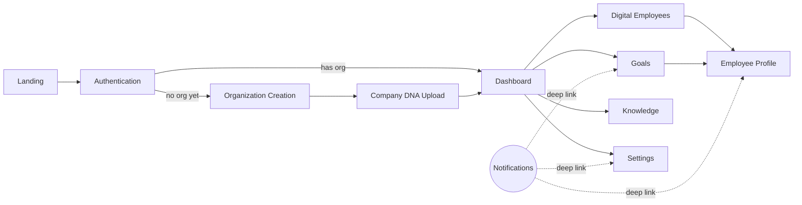

# Velora — Wireframe Specification (MVP)

**Status:** Draft v1.0 — screen-level behavioral spec; no visual design decisions (layout, spacing, color, typography) are made here — that's `docs/design/`'s job once it's populated. This document specifies *what exists on each screen and how it behaves*, not what it looks like.
**Owner:** Product, drafted in collaboration with Engineering and Design
**Depends on:** [PRD.md](./PRD.md), [UserJourney.md](./UserJourney.md), [../architecture/StateMachines.md](../architecture/StateMachines.md), [../architecture/API.md](../architecture/API.md), [../architecture/Security.md](../architecture/Security.md)

---

## 1. Purpose

This document enumerates every screen in Velora's MVP and specifies, for each: its purpose, who sees it, what's on it, what a user can do, and — critically — what it looks like in every state a real backend actually produces (empty, loading, error, success), not just the happy path a mockup usually shows. It exists so that "what happens if this list is empty" or "what happens if this request fails" is answered before implementation, not discovered during it.

**Why states matter more than layout at this stage:** a screen's happy-path layout is the easy 80%. The states in this document map directly to real system behavior already specified elsewhere — a `Loading` state for goal decomposition isn't generic, it's the async task pattern in [API.md §5](../architecture/API.md#5-the-async-task-pattern); an `Error` state for a failed Knowledge upload isn't generic, it's `KnowledgeProcessingFailed` with a specific `error_class` in [EventCatalog.md §5.4](../architecture/EventCatalog.md#54-knowledge). Every state below should be traceable to something already defined in `architecture/`, not invented fresh.

## 2. Shared Conventions

Specified once here rather than repeated eleven times.

### 2.1 Global Shell

Every authenticated screen lives inside a persistent shell:

- **Primary navigation** — Dashboard, Digital Employees, Goals, Knowledge, Settings. Present on every authenticated screen; visibility of individual items is role-gated (§2.3).
- **Notification bell** — unread count badge, opens the Notifications panel (§13) without leaving the current screen.
- **Org/account switcher** — for users belonging to multiple organizations ([Security.md §3.2](../architecture/Security.md#32-multi-org-scoping)); switching issues a new scoped session, which the shell treats as equivalent to a fresh login (full shell reload, not a partial state swap — this is a security boundary, not just a UI transition).

### 2.2 Screens Deliberately Not Listed Separately

The requested screen list doesn't include a few surfaces implied by the PRD; rather than invent new top-level screens, they're folded into the ones below — flagged here so the omission is a decision, not an oversight:

- **Departments** — no standalone screen. Created inline during Organization Creation (from DNA-suggested departments) and managed thereafter under Settings → Departments.
- **Integrations** — no standalone screen. Managed under Settings → Integrations.
- **Tasks / Task detail** — no standalone screen. The Task Kanban board lives inside Goals; a Task's detail (including its Decision Trace) opens as an overlay from either Goals or the owning Digital Employee's Employee Profile.
- **Conversations / Chat** — no standalone screen. Chat with a specific Digital Employee lives in its Employee Profile; a Task-linked conversation thread opens from that Task's detail.

### 2.3 Role Visibility

| Screen | org_admin | department_manager | member | viewer |
|---|---|---|---|---|
| Dashboard | full | full (own depts emphasized) | full (own depts emphasized) | read-only |
| Digital Employees | full | manage own dept's employees | view + chat only | read-only |
| Employee Profile | full config | full config (own dept) | chat + view only | read-only |
| Goals | full | create/approve (own dept) | view + create ad hoc tasks | read-only |
| Knowledge | full | manage (own dept scope) | view only | read-only |
| Settings | full | own dept's budget/roster only | none (redirected) | none (redirected) |
| Notifications | own + org-wide alerts | own + dept alerts | own only | own only |

This mirrors RBAC as defined in [Security.md §5](../architecture/Security.md#5-authorization-model) — the UI hides what a role can't act on, but the enforcement is server-side regardless; the UI hiding an action is a usability courtesy, never the actual security boundary.

### 2.4 State Conventions

- **Loading** for anything routed through the async task pattern ([API.md §5](../architecture/API.md#5-the-async-task-pattern)) shows *what's happening*, sourced from real status, never a bare spinner with no information — consistent with the "wait for it to work" moment flagged in [UserJourney.md §3](./UserJourney.md#3-primary-journey-founder--org-admin--the-first-15-minutes).
- **Error** states always show a plain-language message derived from the API's `error.message` ([API.md §7](../architecture/API.md#7-error-format)), never a raw `error.code` or stack trace, plus a `request_id` available on demand (e.g., behind a "copy details" affordance) for support escalation.
- **Empty** states are never a bare "no data" — each one below states the specific CTA that moves the user toward the core loop ([PRD.md §4](./PRD.md#4-core-product-loop)).
- **Success** feedback for a state-changing action is a toast/inline confirmation, not a modal requiring dismissal — it should not interrupt momentum.

## 3. Landing Page

**Purpose:** Convert an anonymous visitor into a signed-up user. Public, unauthenticated, marketing-owned content.
**Primary user:** Anonymous visitor.

**Components**
- Hero: value proposition, primary CTA ("Start hiring")
- Workforce showcase (illustrative Digital Employee roles/departments)
- Product overview sections (Company DNA, autonomy/trust, collaboration)
- Pricing teaser (links to a dedicated pricing surface, not detailed here — see `docs/pitch/`)
- Footer: company links, legal

**Actions**
- Sign up → Authentication (§4, signup mode)
- Log in → Authentication (§4, login mode)
- Navigate to marketing subsections (anchor scroll, no state implications)

**States**

| State | Behavior |
|---|---|
| Empty | N/A — static content |
| Loading | Skeleton only for any dynamic block (e.g., a live customer counter); everything else is statically rendered/cached |
| Error | A failed dynamic block (e.g., testimonial feed) fails silently to its last-known-good static fallback — never a visible error on a page whose entire job is to build confidence |
| Success | N/A — success is the visitor clicking through, not a system state |

**Navigation:** Top nav (Product, Pricing, Log in, Sign up). An already-authenticated visitor hitting this URL is redirected straight to Dashboard — the landing page is never shown to a logged-in user.
**Responsive behavior:** Nav collapses to a hamburger below tablet width; hero and showcase sections stack vertically; CTA remains reachable without scrolling on mobile (sticky header CTA).

## 4. Authentication

**Purpose:** Establish human identity — signup, login, MFA, SSO, password reset. Governed by [Security.md §2](../architecture/Security.md#2-identity-model) and [§3.1](../architecture/Security.md#31-authn-flow).
**Primary user:** New or returning human user, not yet scoped to a specific organization's session.

**Components**
- Email/password fields (login and signup share a layout, toggled by mode)
- OAuth buttons (Google, Microsoft)
- SSO entry point (org-lookup by email domain, redirects to the org's IdP)
- MFA challenge (code entry) — appears only when the account requires it
- "Forgot password" link → reset flow
- Terms acceptance checkbox (signup only)

**Actions**
- Submit credentials / initiate OAuth / initiate SSO
- Enter MFA code
- Request password reset
- Toggle between login and signup modes

**States**

| State | Behavior |
|---|---|
| Empty | N/A — form-based |
| Loading | Submit control shows an inline spinner and disables the form for the duration of the auth call; no full-page loading transition |
| Error | Inline, field-adjacent errors: invalid credentials, MFA code rejected, account locked, rate-limited (`429`) with a visible cooldown. Never reveal whether it was the email or the password specifically that was wrong. |
| Success | Immediate redirect — see below |

**Navigation:** Logo returns to Landing Page. On successful auth: a user with no organization memberships → Organization Creation (§5); a user with exactly one → Dashboard (§6); a user with more than one → the org switcher, then Dashboard.
**Responsive behavior:** Single-column form on mobile; desktop may show a split layout (form + marketing panel) — the form itself never reflows its field order across breakpoints.

## 5. Organization Creation

**Purpose:** Create the tenancy root and its first Department(s). Satisfies `ORG-1`, `ORG-3` ([PRD.md §6.1](./PRD.md#61-organization-onboarding)).
**Primary user:** Founder / first `org_admin`.

**Components**
- Organization name, industry, team size, country/region (drives data residency pin — [Database.md §2](../architecture/Database.md#2-multi-tenancy-model))
- Initial Department suggestions (pre-filled from industry selection at this stage; refined further once Company DNA is built — see §6's cross-reference to `DNA-4`)
- Submit action

**Actions**
- Submit → creates the organization and the submitting user's `org_admin` membership
- Adjust suggested Departments (rename, remove, add) before confirming

**States**

| State | Behavior |
|---|---|
| Empty | N/A — this screen only exists pre-organization |
| Loading | Brief inline spinner on submit — this is a fast synchronous operation, not routed through the async task pattern |
| Error | Field validation (required fields); organization slug conflict resolved automatically (no user-visible slug concept at all — internal detail) rather than surfaced as an error the user has to solve |
| Success | Immediate transition to Company DNA Upload (§6) — no intermediate confirmation screen; momentum matters more than confirmation here |

**Navigation:** Cannot be reached once an organization already exists for the current session except via "Create another organization" from the org switcher.
**Responsive behavior:** Single-column form; Department suggestion chips wrap rather than horizontally scroll on narrow viewports.

## 6. Company DNA Upload

**Purpose:** Seed Company DNA — the mechanism that makes Digital Employees sound like *this* business ([CompanyDNA.md](../architecture/CompanyDNA.md)). Satisfies `DNA-1`, `DNA-2`, and the extraction experience flagged as tentative `DNA-4` in [PRD.md §10](./PRD.md#10-open-questions).
**Primary user:** `org_admin`.

**Components**
- Mode toggle: **Upload/Connect** (files, website URL, connected app) vs. **Questionnaire** (mission, tone adjectives, do's/don'ts) — not mutually exclusive, both can contribute
- Progress checklist reflecting the Knowledge Processing pipeline ([StateMachines.md §6](../architecture/StateMachines.md#6-knowledge-processing-pipeline)): e.g. *products/services detected, brand voice identified, policies extracted, departments suggested*
- Compiled summary preview (once ready) for review before publish
- "Skip for now" affordance (proceeds with template defaults, published later)

**Actions**
- Upload a file / paste a URL / connect a source
- Answer questionnaire fields
- Review the compiled summary
- Publish the first DNA version
- Skip (with a clear note that Digital Employees will sound generic until DNA is published)

**States**

| State | Behavior |
|---|---|
| Empty | No sources yet — Questionnaire is presented as the primary path, Upload/Connect as an alternative, not the reverse (removes dependency on the user having documentation ready) |
| Loading | Per-item processing status mapped directly to pipeline stages ([StateMachines.md §6](../architecture/StateMachines.md#6-knowledge-processing-pipeline)) — chunking → embedding → summarizing → committing — surfaced as the checklist filling in live, not a single spinner for the whole operation |
| Error | `KnowledgeProcessingFailed` shown per source with a plain-language reason and a retry action ([EventCatalog.md §5.4](../architecture/EventCatalog.md#54-knowledge)); a failure on one source never blocks the others from completing |
| Success | Compiled summary rendered for review; publishing emits `CompanyDnaPublished` and advances to Digital Employees (§7) with recommendations informed by whatever was detected |

**Navigation:** "Skip for now" → Dashboard directly (DNA remains unpublished, addressable later from Settings → Company DNA). Back → Organization Creation is not available once submitted (org already exists; DNA can only be added to going forward, not "restarted").
**Responsive behavior:** Checklist collapses to an accordion on mobile; the dropzone becomes a tap-to-open file picker; questionnaire fields remain single-column at all widths.

## 7. Dashboard

**Purpose:** The home screen — at-a-glance workforce activity, what needs the user's attention, and quick paths into the rest of the product.
**Primary user:** All roles; content emphasis shifts by role (§2.3).

**Components**
- Approval queue widget (items flagged `approve` — `OVR-1`)
- Goal progress widgets (active Goals vs. target metric)
- Digital Employee activity summary (recent completions, escalations)
- Task board preview (top of the Goals board, not the full board)
- "Hire your first Digital Employee" hero — only rendered pre-first-hire (see Empty state)

**Actions**
- Approve/reject an item inline without leaving the dashboard
- Click through to any widget's full screen (Goals, Digital Employees, etc.)
- Quick-create a Goal

**States**

| State | Behavior |
|---|---|
| Empty | No Digital Employees hired yet: the entire dashboard is replaced by the hire CTA hero — showing empty widgets ("0 tasks, 0 goals") would undersell a product whose entire value is the workforce, not the dashboard chrome around it |
| Loading | Skeleton cards per widget; widgets load independently, not gated behind a single all-or-nothing spinner |
| Error | Partial-failure tolerant: if one widget's data source is unavailable, that widget alone shows an inline retry — the rest of the dashboard renders normally. A single failed dependency must never blank the whole home screen. |
| Success | Fully populated; real-time updates via the Realtime Gateway push new activity in without a manual refresh |

**Navigation:** Root of the primary navigation — every other screen is reachable from here, and it's the default landing screen post-login.
**Responsive behavior:** Widgets stack to a single column on mobile in a fixed priority order (approvals first, then goals, then activity) — priority order is itself a product decision: approvals are time-sensitive, activity is not.

## 8. Digital Employees

**Purpose:** View and manage the organization's workforce roster. Satisfies `EMP-1`, `EMP-3` ([PRD.md §6.3](./PRD.md#63-digital-employee-lifecycle)).
**Primary user:** `org_admin`, `department_manager`.

**Components**
- Employee cards/grid: avatar, name, role, department, lifecycle status badge ([StateMachines.md §2](../architecture/StateMachines.md#2-digital-employee-lifecycle)), quick stats (tasks this week, escalation rate)
- Department filter, status filter, search
- "Hire" CTA, with DNA-informed recommendations surfaced above the general template catalog (tentative `EMP-5`)

**Actions**
- Hire a new Digital Employee (template browse or accept a recommendation)
- Filter/search the roster
- Quick actions per card: pause, resume, retire (with confirmation)
- Click a card → Employee Profile (§9)

**States**

| State | Behavior |
|---|---|
| Empty | No employees yet — recommendations (if DNA is published) or the general template catalog fill the screen in place of an empty grid |
| Loading | Skeleton cards matching the roster's expected density |
| Error | Roster failed to load — full-screen inline retry, since this screen has no meaningful content without it |
| Success | Populated grid; a newly hired employee appears immediately in `draft` status, not after a delay |

**Navigation:** From primary nav; each card opens Employee Profile (§9); "Hire" opens the hiring flow as an overlay rather than a full navigation away (keeps the roster context underneath).
**Responsive behavior:** Grid collapses to a single-column list on mobile; filters move into a bottom-sheet rather than an inline row.

## 9. Employee Profile

**Purpose:** Configure, monitor, and communicate with one specific Digital Employee. Satisfies `EMP-2`, `EMP-4`, `OVR-3`, `COLLAB-1` ([PRD.md §6.3, §6.5, §6.7](./PRD.md#63-digital-employee-lifecycle)).
**Primary user:** `department_manager`/`org_admin` for configuration; `member` for chat/view.

**Components**
- Identity header: avatar, name, role, department, lifecycle status
- Tabs: **Overview** (performance record — success rate, escalation rate, cost-to-serve, [AIEmployees.md §9](../architecture/AIEmployees.md#9-performance-record)), **Permissions & Autonomy** (per-action-type `autonomous`/`notify`/`approve` controls, [AIEmployees.md §6](../architecture/AIEmployees.md#6-human-oversight-model-autonomy-levels)), **DNA Binding** (current pinned version, upgrade action), **Activity** (recent Tasks and their Decision Traces), **Chat** (direct conversation)
- Lifecycle actions: pause / resume / retire

**Actions**
- Send a chat message
- Adjust an autonomy toggle for a specific action type
- Upgrade to a newer published DNA version
- Reassign to a different Department
- Pause / resume / retire (each with a confirmation step for the irreversible case — retire)
- Open a specific Task's Decision Trace from the Activity tab

**States**

| State | Behavior |
|---|---|
| Empty | Newly hired, no activity yet — Overview tab shows "Riley hasn't completed any tasks yet" with a direct path to assign one or start a chat, rather than empty charts at zero |
| Loading | Performance charts skeleton independently of the identity header, which renders immediately (it's static data, no reason to gate it behind the same load) |
| Error | A failed config change (e.g., autonomy update rejected by the Policy Engine) surfaces inline on the specific control, not as a page-level banner — the user should know exactly which toggle didn't take |
| Success | Config changes confirm via inline toast; chat messages appear optimistically then reconcile with the server-confirmed state |

**Navigation:** From Digital Employees (§8) or a Notification deep link (§13) or a Task detail overlay from Goals (§10). Back returns to wherever the user came from, not unconditionally to the roster.
**Responsive behavior:** Tabs become a horizontally scrollable strip on mobile rather than wrapping; the Chat tab, when active on mobile, takes the full screen (keyboard real estate takes priority over persistent header chrome).

## 10. Goals

**Purpose:** State business objectives, review and approve their decomposition, and track execution. Satisfies `GOAL-1`, `GOAL-2`, `GOAL-3`, `TASK-1`, `TASK-2` ([PRD.md §6.4](./PRD.md#64-goals-projects--tasks)).
**Primary user:** `department_manager` (create/approve), `org_admin` (org-wide view), `member` (view, create ad hoc tasks).

**Components**
- Goal list: title, target metric with current progress, status badge (`proposed`/`active`/`at_risk`/`achieved`/`abandoned`, [StateMachines.md §4](../architecture/StateMachines.md#4-goal-lifecycle))
- "New Goal" natural-language input
- Decomposition review overlay: proposed Projects/Tasks, editable before approval
- Task board (Kanban: `pending`/`claimed`/`in_progress`/`blocked`/`done`/`failed`, [StateMachines.md §3](../architecture/StateMachines.md#3-task-lifecycle)), filterable by Department/Digital Employee/Goal
- Ad hoc task creation (no Goal attached)

**Actions**
- State a new Goal in natural language
- Approve, edit, or reject a proposed decomposition
- Create an ad hoc Task and assign it directly
- Filter the board
- Open a Task to view its detail/Decision Trace

**States**

| State | Behavior |
|---|---|
| Empty | No Goals yet — the "New Goal" input is presented front-and-center with an example (*"e.g. Increase qualified leads by 20%"*) rather than a bare empty board |
| Loading | Decomposition is an async task ([API.md §5](../architecture/API.md#5-the-async-task-pattern)) — shows "Velora is planning this out…" with real progress if the planning pipeline exposes intermediate steps, not a bare spinner exceeding a few seconds unexplained |
| Error | Decomposition failure offers a direct fallback to manual Task creation rather than a dead end — the user should never be blocked from doing the work because the planning step failed |
| Success | Approved Goal populates the board immediately; `GoalCompleted` renders as a distinct, positive terminal state on the Goal card, not just an identical-looking status change |

**Navigation:** From primary nav or Dashboard's board preview. Task cards open a detail overlay (not a full navigation) showing the Decision Trace and a link into the assigned Digital Employee's Employee Profile.
**Responsive behavior:** Kanban columns become horizontally swipeable on mobile with a sticky column-header row; a list-view toggle is available as a fallback for users who find swiping columns awkward on small screens.

## 11. Knowledge

**Purpose:** Manage Knowledge Sources feeding Company DNA and/or Memory, on an ongoing basis (beyond the initial DNA Upload flow). Satisfies `KNOW-1`, `KNOW-2`, `KNOW-3` ([PRD.md §6.6](./PRD.md#66-knowledge-management)).
**Primary user:** `org_admin`, `department_manager` (own department's sources).

**Components**
- List of Knowledge Sources: name/origin, scope (org-wide or a specific Department), destination tag (Company DNA / Memory / both), status badge ([StateMachines.md §5](../architecture/StateMachines.md#5-knowledge-source-lifecycle))
- Upload/connect action, scoped to a Department or org-wide
- Per-item detail: processing status, chunk count once indexed, delete action

**Actions**
- Upload a new source or connect an app, scoped explicitly
- Retry a failed source
- Delete a source (triggers the redaction cascade, [Memory.md §6.2](../architecture/Memory.md#62-right-to-forget))
- Filter by Department or destination

**States**

| State | Behavior |
|---|---|
| Empty | No sources for the current filter scope — CTA to upload/connect scoped to whatever Department is currently selected |
| Loading | Per-item processing indicator, same pipeline mapping as §6; the list itself loads independently of any single item's processing state |
| Error | Failed items show `error_class` in plain language with retry; a failed deletion shows a toast with retry rather than leaving the item in an ambiguous state |
| Success | Newly indexed items show their destination and chunk count; a completed deletion confirms explicitly *what* was removed — per [UserJourney.md §7.2](./UserJourney.md#72-knowledge-deletion--right-to-forget), silence on a deletion request is itself a failure, even if the deletion technically succeeded |

**Navigation:** From primary nav; also reachable from Settings → Company DNA (for DNA-destined sources specifically) and from Employee Profile → DNA Binding (to see what feeds the currently bound version).
**Responsive behavior:** List rows collapse to stacked cards; the destination/scope tags move below the title rather than in a column, to avoid horizontal crowding.

## 12. Settings

**Purpose:** Organization-level configuration: profile, departments, members, integrations, billing, security, DNA version history.
**Primary user:** `org_admin` (full access); `department_manager` (own department's roster/budget only).

**Components**
- Sectioned navigation: **Organization Profile**, **Departments**, **Members & Roles**, **Integrations**, **Billing & Plan**, **Security** (MFA/SSO), **Company DNA** (version history, publish, diff view)
- Department CRUD (name, function type, monthly budget cap — `BILL-2`)
- Member invite + role assignment
- Integration connect/disconnect per provider ([IntegrationStrategy.md §4](../architecture/IntegrationStrategy.md#4-provider-notes)) — MVP scope is Email and Slack only
- Plan/usage summary (`BILL-1`, `BILL-3`)

**Actions**
- Edit organization profile fields
- Create/rename/archive a Department
- Invite a member, change or revoke a role
- Connect/disconnect an integration
- Adjust a Department's budget cap
- Enable MFA, configure SSO
- View DNA version history, publish a new version, view a diff against the previous compiled summary

**States**

| State | Behavior |
|---|---|
| Empty | No integrations connected — Integrations section leads with the connect CTA; no Departments beyond the default — prompts creation with the same DNA-informed suggestions used at onboarding |
| Loading | Each section loads independently (this is a multi-section screen — a slow Billing call must not block rendering Departments) |
| Error | Integration OAuth failure shown inline on that provider's row with a specific reason and reconnect action ([EventCatalog.md §5.9](../architecture/EventCatalog.md#59-integration)); field-level validation errors on save |
| Success | Section-scoped toast confirmations; a budget cap change takes effect immediately and is reflected the next time a costly operation is evaluated, not on a delay |

**Navigation:** From primary nav (gear icon) or the org/account switcher. Sub-navigation is persistent within Settings so switching sections doesn't feel like a full page change.
**Responsive behavior:** Sub-navigation collapses to a dropdown/select above the content on mobile — one section visible at a time, never a squeezed two-pane layout.

## 13. Notifications

**Purpose:** Surface everything that needs a human's attention outside the screen they're currently on — `notify`-level actions, approvals, and system alerts. Satisfies `OVR-2` and delivery of events like `GoalAtRisk`, `IntegrationTokenRefreshFailed`, `BudgetExceeded` ([EventCatalog.md](../architecture/EventCatalog.md)).
**Primary user:** All roles — content scoped per §2.3.

**Components**
- Notification list, grouped by recency, with type indicators (approval / notify-level action / system alert)
- Filter: All / Approvals needed / System
- Unread indicator, mark-as-read, clear-all
- Link to notification preferences (→ Settings)

**Actions**
- Click a notification → deep link to the relevant screen/context (Employee Profile, a specific Task, Settings → Integrations, etc.)
- Mark read/unread, clear all
- Adjust preferences

**States**

| State | Behavior |
|---|---|
| Empty | "You're all caught up" — explicitly positive framing, not a neutral "no notifications," since an empty queue is a good outcome the product should feel good about surfacing |
| Loading | Skeleton list rows |
| Error | Failed to load — inline retry banner within the panel; this never blocks the rest of the app, since the panel is an overlay, not a full-screen route |
| Success | New notifications arrive in real time via the Realtime Gateway (push, not poll) with an unobtrusive toast plus the badge count updating |

**Navigation:** Opens as a panel/overlay from the bell icon on every authenticated screen — deliberately not a full-page route, so acting on a notification doesn't require losing the screen the user was already on. Deep links from within it do navigate away.
**Responsive behavior:** Overlay panel on desktop (anchored to the bell icon); full-screen view on mobile, since there's no room for an anchored panel without obscuring the content beneath it.

## 14. Non-Goals

- No visual design decisions — color, spacing, typography, iconography belong to `docs/design/` once populated, not here.
- No component-level implementation detail (which shadcn/ui primitive backs which control) — that's a frontend engineering decision made against [EngineeringStandards.md §2.2](../engineering/EngineeringStandards.md#22-frontend-nextjs-15-app-router), not a product spec concern.
- No exhaustive enumeration of every micro-interaction (hover states, animation timing) — this document specifies screen-level behavior and system-driven states, not motion design.
- No screens beyond MVP scope — anything gated to Phase 2/3 in [PRD.md §9](./PRD.md#9-release-phasing) (e.g., a partner API console, BYOK key management UI) has no screen spec here because it has no MVP requirement to satisfy yet.
